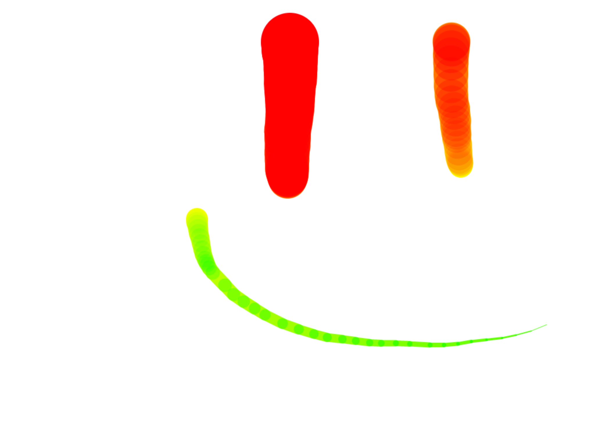

# HTML5 Canvas: Vanilla JS

## Table of Contents

- [Description](#description)
- [Usage](#usage)
- [Credits](#credits)
- [License](#license)

## Description

A fun press-and-hold art creator established with HTML's `canvas` element. Created with only Vanilla JavaScript.

## Usage

## Credits

Wes Bos's Vanilla JavaScript 30 Day Challenge
https://javascript30.com/

## License

No licenses (default copyright laws apply).

---
